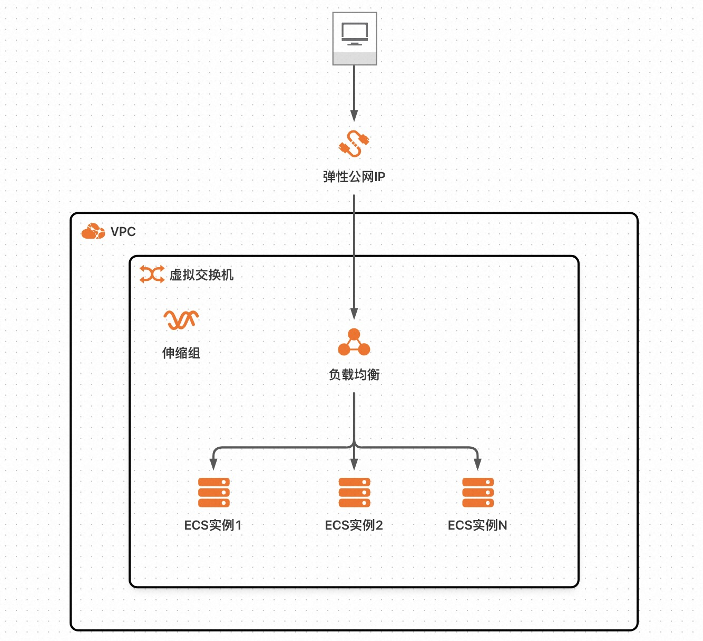
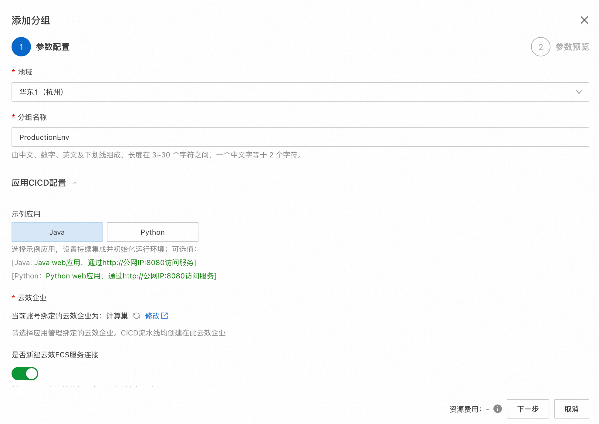
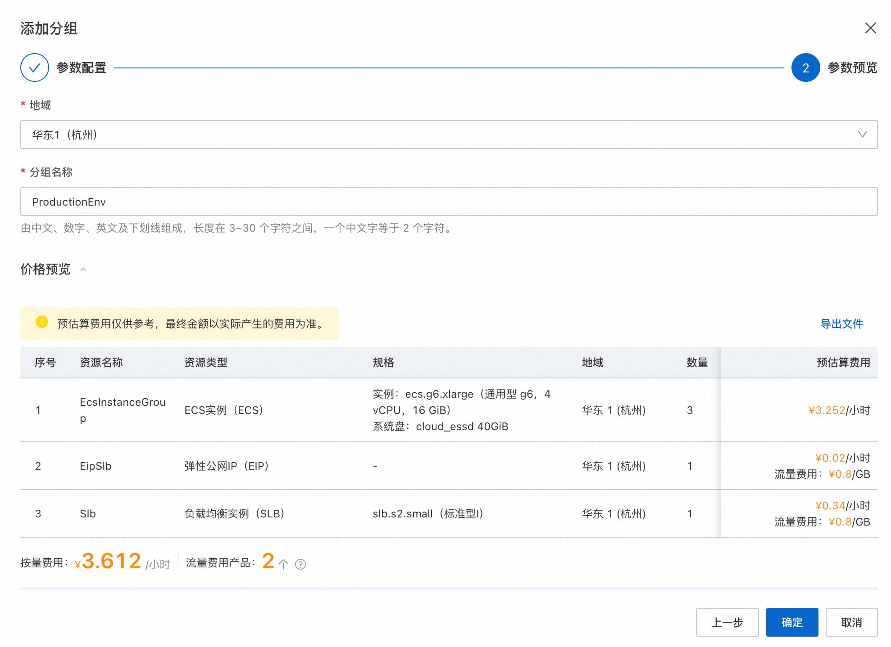
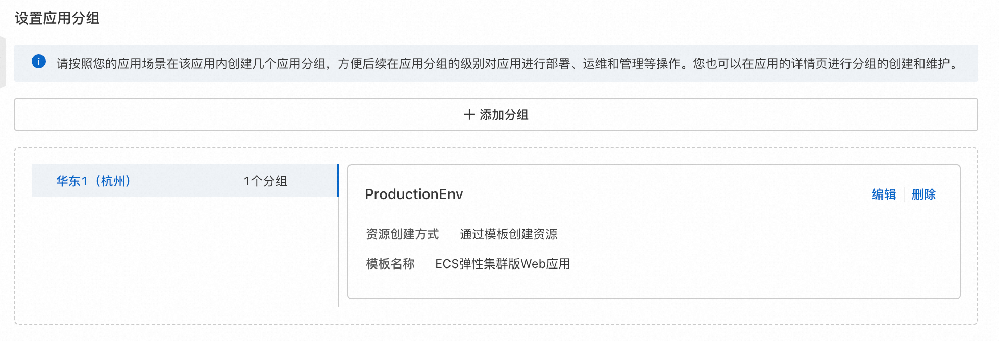
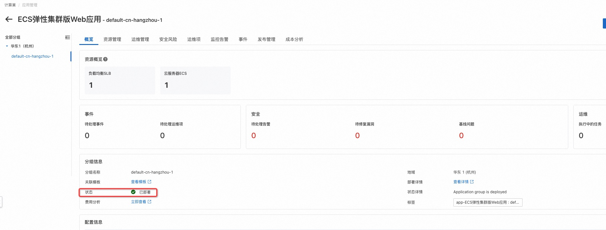
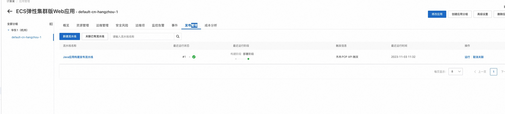
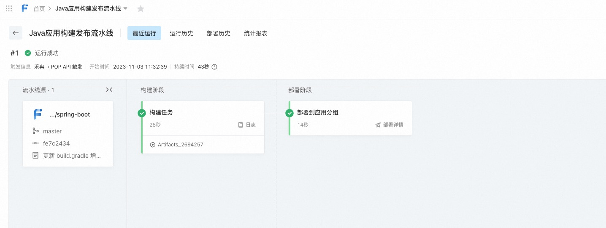
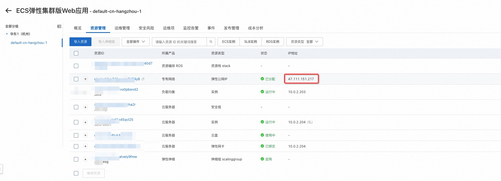
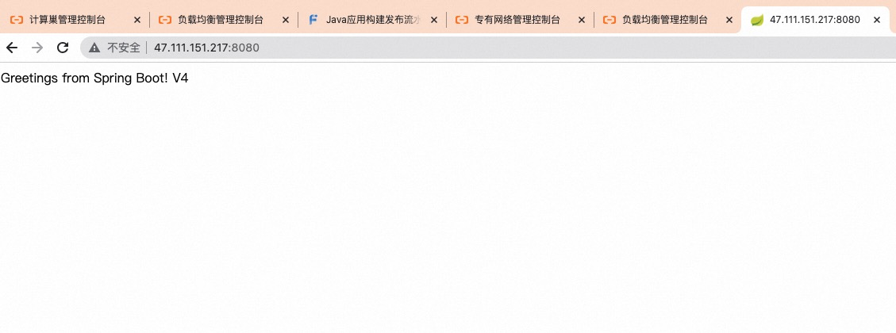

# ECS弹性集群版Web应用说明文档

## 概述
ECS弹性集群版Web应用模板是一个基于ECS弹性伸缩组和负载均衡器的无状态Web服务，是一种常见的生产环境高可用服务部署方式。
部署此应用时，用户只需要选择示例软件并输入ECS实例密码、SLB规格等少量参数，即可一键部署运行环境并设置好代码的持续集成和持续部署。

部署完成的应用分组包含若干台ECS实例、一个SLB负载均衡实例、一个弹性伸缩组、一个从示例代码源编译并发布应用到ECS实例上的CICD流水线，并自动触发一次初始发布。

- ECS实例自动加入SLB后端服务器组和弹性伸缩组
- 默认创建的弹性配置不会进行自动伸缩
- SLB实例绑定弹性公网IP提供公网服务，ECS实例不开公网提高安全性
- 弹性伸缩组与SLB实例关联，伸缩组中新增的实例会自动加入SLB后端服务器组，也会自动加入应用分组
- 云效流水线关联应用分组，分组中资源的增加减少不需要变动流水线

架构图如下：

待应用部署完成且流水线执行成功时，访问SLB实例绑定的弹性公网IP即可访问服务。您可以按需求修改应用：
- 您可以在发布页修改流水线中的代码源为您自己的代码，重新发布后即可部署您自己的应用代码。
- 您可以自行修改SLB的监听配置，比如监听端口、会话保持等等
- 您可以在应用管理的运维管理页面对伸缩组进行扩缩容，也可以将伸缩配置改为自动伸缩。

## 计费说明
部署此应用的费用主要涉及：

- 所选vCPU与内存规格
- 磁盘容量
- SLB规格
- EIP公网带宽

计费方式包括：

- 按量付费（小时）
- 包年包月

预估费用在部署前可实时看到。

## RAM账号所需权限
若您使用RAM用户创建应用，为了使用应用管理的完整功能，需要对使用的RAM用户的账号添加相应资源的权限。添加RAM权限的详细操作，请参见[为RAM用户授权](https://help.aliyun.com/document_detail/455313.html)。

为了部署此应用，所需权限如下表所示。

| 权限策略名称                       | 备注                     |
|------------------------------|------------------------|
| AliyunECSFullAccess          | 管理云服务器服务（ECS）的权限       |
| AliyunVPCFullAccess          | 管理专有网络（VPC）的权限         |
| AliyunROSFullAccess          | 管理资源编排服务（ROS）的权限       |
| AliyunSLBFullAccess          | 管理负载均衡服务（SLB）的权限       |
| AliyunESSFullAccess          | 管理弹性伸缩服务（ESS）的权限       |
| AliyunCloudMonitorFullAccess | 管理云监控（CloudMonitor）的权限 |
| AliyunRDCFullAccess          | 管理云效的权限                |

## 部署流程
### 访问应用管理

### 部署步骤
1. 访问应用管理控制台，点击“创建应用”后选择“通过模板创建”，在选择“ECS弹性集群版Web应用”模板，点击“使用模板”
2. 输入应用名称、应用描述后，点击“添加分组”
3. 输入部署参数，保存分组。保存前可以预览费用明细和参数。

4. 输入应用高级设置后，点击创建

### 部署参数说明
您在部署应用的过程中，需要配置环境和CICD参数。下文介绍输入参数的详细信息。

| 参数组      | 参数项           | 示例             | 说明                                          |
|----------|---------------|----------------|---------------------------------------------|
| 应用CICD配置 | 示例应用          | Java           | 选择不同编程语言的Web服务示例应用                          |
| 应用CICD配置 | 云效企业          | 企业名            | 默认使用当前账号绑定的云效企业。如果未绑定请在OOS全局配置->发布配置中绑定云效企业 |
| 应用CICD配置 | 是否新建云效ECS服务连接 | 是              | 是否以当前账号权限创建云效ECS服务连接，云效使用服务连接在ECS实例上部署      |
| 应用CICD配置 | 是否运行CICD流水线   | 是              | 是否运行一次CICD流水线，执行应用的初次发布                     |
| ECS配置    | 付费类型          | 按量付费 或 包年包月    |                                             |
| ECS配置    | 实例类型          | ecs.g6.large   | 实例规格，可以根据实际需求选择                             |
| ECS配置    | 系统盘类型         | cloud_essd     |                                             |
| ECS配置    | 系统盘大小         | 120GB          |                                             |
| ECS配置    | 实例密码          |                | 登录密码                                        |
| ECS配置    | 实例数量          | 3              | 创建初始ECS实例的数量                                |
| SLB配置    | 规格            | slb.s1.small   | 负载均衡实例规格，可以根据实际需求选择                         |
| SLB配置    | 负载均衡公网带宽      | 10Mbps         | 负载均衡绑定的弹性公网IP的最大带宽                          |
| 可用区配置    | 可用区           | 杭州可用区K         |                                             |
| 网络配置     | 是否新建VPC       | 是              | 是否创建一个新VPC                                  |
| 网络配置     | 专有网络IPv4网段    | 192.168.0.0/16 | VPC的ip地址段范围                                 |
| 网络配置     | 交换机子网网段       | 192.168.0.0/24 | 交换机子网网段                                     |
| 网络配置     | 现有VPC的实例ID    | vpc-xxx        |                                             |
| 网络配置     | 现有网络交换机ID     | vsw-xxx        |                                             |

### 验证结果

1. 查看应用。应用创建成功后，环境部署时间和ECS实例个数有关。状态变为“已部署”即为部署完成

2. 部署完成后，会自动进行首次的应用发布

3. 点击流水线名称可以看到流水线状态

4. 发布完成后，从资源管理中找到负载均衡绑定的公网IP

5. 通过访问http://公网IP:8080即可访问HelloWorld示例服务

6. 编辑流水线，可以替换代码源为您自己的应用代码源。重新发布后，就可以访问您自己的服务了。
注意如果您的服务使用了8080外的其他端口，需要在安全组中放开该端口的入方向访问。在资源管理中可以找到安全组，点击修改安全组规则。
